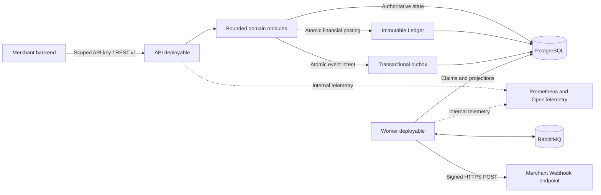

# SettleFlow

[](https://github.com/Sye-1321/SettleFlow/actions/workflows/ci.yml)
[](https://github.com/Sye-1321/SettleFlow/actions/workflows/security.yml)
[](https://github.com/Sye-1321/SettleFlow/actions/workflows/nightly.yml)
[](LICENSE)

SettleFlow is an open-source, finance-grade simulation of a merchant payment platform. It follows a payment from intent and capture through immutable accounting, reliable event delivery, signed Webhooks, settlement batching, and reconciliation against a mock provider statement.

**The project demonstrates financial correctness through executable evidence, not a production-readiness claim.**

SettleFlow does not connect to real payment rails, move funds, initiate payouts, or store cardholder data. The authoritative baseline is the [SettleFlow v1.0 specification](docs/specification/SettleFlow_Technical_Product_and_Architecture_Specification_v1.0.docx), refined by accepted [architecture decisions](docs/adr/README.md) without weakening the [financial invariants](docs/architecture/financial-invariants.md).

## Why SettleFlow exists

Typical payment examples stop after a successful request. SettleFlow focuses on what happens when:

- financial commands are duplicated or race each other;
- Payment state, balanced Ledger entries, and an event intent must commit atomically;
- RabbitMQ is unavailable or a worker crashes between publication and acknowledgement;
- signed Webhook delivery must remain retryable without opening an SSRF path;
- concurrent settlement runs compete for the same eligible Payment; and
- reconciliation finds a difference that must be explained without rewriting financial history.

The implementation uses PostgreSQL constraints, explicit transactions, idempotency records, outbox/inbox delivery, failure injection, and operational runbooks to make those behaviors testable.

## Architecture



The API and worker are separate deployables from one NestJS modular-monolith codebase. PostgreSQL is the authoritative transactional and financial store. RabbitMQ and telemetry are deliberately non-authoritative. See the [architecture overview](docs/architecture/README.md) and [module boundaries](docs/architecture/module-boundaries.md) for the complete design.

## Core capabilities

| Area            | Implemented capability                                                                                              |
| --------------- | ------------------------------------------------------------------------------------------------------------------- |
| Merchant Access | Hashed, scoped, revocable API keys with one-time plaintext disclosure and merchant-scoped persistence               |
| Payments        | Payment Intent create/read, deterministic direct full capture, and partial/full refunds in ETB or USD               |
| Idempotency     | Merchant-scoped command ownership, canonical fingerprints, leases, conflicts, and stored response replay            |
| Ledger          | Closed merchant chart, immutable double-entry postings, deferred balance enforcement, and exact reversals           |
| Eventing        | Transactional outbox, publisher confirms, durable inbox deduplication, manual acknowledgements, and DLQs            |
| Webhooks        | Endpoint management, encrypted rotating secrets, SSRF controls, exact-byte signatures, and bounded delivery retries |
| Settlements     | Merchant/currency-isolated eligibility, deterministic fees, batching, adjustments, and guarded Ledger finalization  |
| Reconciliation  | Bounded mock-provider CSV staging and deterministic, non-mutating mismatch classification                           |
| Operations      | Structured redacted logs, correlation context, internal probes, metrics, alerts, hardened images, and CI evidence   |

Detailed claim-to-test evidence is maintained in the [engineering evidence guide](docs/review/engineering-evidence.md).

## Financial correctness

SettleFlow treats these guarantees as release-blocking:

- Money is represented as positive integer minor units with an explicit currency.
- Payment, refund, or Settlement state commits with its balanced Ledger posting and outbox event, or all effects roll back.
- Every posted Ledger transaction has at least two entries, one currency, and equal debit and credit totals.
- Posted Ledger transactions and entries are immutable; corrections use a uniquely linked reversal.
- Row locking, constraints, and idempotency prevent over-refund, duplicate settlement membership, and repeated financial side effects.
- Payment and Settlement lifecycles remain separate, and asynchronous delivery is explicitly at-least-once rather than exactly-once.

PostgreSQL constraints and triggers enforce the accounting boundary; application validation does not replace them. The complete normative rules are [INV-01 through INV-10](docs/architecture/financial-invariants.md).

## Run the deterministic demo

The isolated demo exercises the API, worker, PostgreSQL, RabbitMQ, Ledger, Webhooks, Settlements, Reconciliation, telemetry, and dependency-recovery paths using synthetic data only. Docker with Linux containers and the pinned Node.js/pnpm toolchain are required.

PowerShell:

```powershell
pnpm install --frozen-lockfile
$env:SETTLEFLOW_DEMO_MODE = 'true'
pnpm demo
```

POSIX shell:

```sh
pnpm install --frozen-lockfile
SETTLEFLOW_DEMO_MODE=true pnpm demo
```

The flow covers idempotent creation, a same-key capture storm, balanced capture/refund/Settlement postings, signed Webhook retry, deterministic reconciliation, RabbitMQ outage recovery, outbox catch-up, and consumer deduplication. See the [demo contract and safety boundary](docs/demo/README.md) before running or resetting it.

## Project status and boundaries

SettleFlow is a **pre-release finance-grade simulation**. It is not production-ready or specification-complete.

The project intentionally excludes real payment providers, bank transfers and payouts, card storage, KYC/AML, customer wallets, subscriptions, FX, tax, disputes, chargebacks, authorize-then-capture, and partial capture. Public Ledger reads, Webhook-delivery inspection/manual replay, destructive retention jobs, dashboards, and a production KMS adapter are also deferred.

The isolated PostgreSQL restore meets the reference RTO target, but a sustained backup cadence has not proven the RPO. Reference k6 scenarios now have executable definitions, while final candidate measurements, clean-room release verification, and immutable `v1.0.0` publication remain open. Catastrophic RabbitMQ-volume loss can still lose published-but-unconsumed work because controlled recovery replay is deferred.

CI enforces approved global and critical-module coverage floors and verifies migrations, grants, financial invariants, contracts, real-dependency integration, concurrency, failure recovery, security policy, image scans, SBOMs, and provenance evidence. Exact current evidence belongs in the [engineering evidence guide](docs/review/engineering-evidence.md) and [CI documentation](docs/operations/continuous-integration.md), not in this landing page.

## Development

The repository pins its Node.js and pnpm versions and uses one pnpm workspace lockfile. Install the workspace from the repository root:

```shell
corepack enable pnpm
pnpm install --frozen-lockfile
```

Local API/worker development requires the safe environment examples, PostgreSQL, RabbitMQ, runtime-role provisioning, and committed migrations. Follow the [local development guide](docs/operations/local-development.md) for the exact setup, database, application, verification, and reset commands.

Common source checks are:

```shell
pnpm format:check
pnpm lint
pnpm typecheck
pnpm test
pnpm build
```

## Documentation

| Document                                                             | Purpose                                                           |
| -------------------------------------------------------------------- | ----------------------------------------------------------------- |
| [Local development](docs/operations/local-development.md)            | Environment, infrastructure, database, API/worker, and test setup |
| [Architecture overview](docs/architecture/README.md)                 | Deployables, consistency model, and bounded modules               |
| [System and reliability flows](docs/architecture/system-flows.md)    | Context, atomicity, outbox/inbox, Webhook, Settlement, deployment |
| [Data model and ERD](docs/architecture/data-model.md)                | Module-owned schema inventory and critical relationships          |
| [Financial invariants](docs/architecture/financial-invariants.md)    | Normative accounting, lifecycle, and concurrency rules            |
| [Architecture decisions](docs/adr/README.md)                         | Accepted technical decisions and trade-offs                       |
| [OpenAPI](docs/api/openapi.json)                                     | Machine-readable HTTP contract                                    |
| [Events and Webhook signing](docs/events/README.md)                  | Closed event schemas, AMQP metadata, and signed-delivery contract |
| [Deterministic demo](docs/demo/README.md)                            | Isolated ten-step execution and sanitized evidence                |
| [Engineering evidence](docs/review/engineering-evidence.md)          | Detailed claim-to-test evaluation path and evidence boundaries    |
| [Requirements evidence](docs/review/requirements-evidence-matrix.md) | P0/P1, INV-01–INV-10, waivers, limitations, and release gates     |
| [Continuous integration](docs/operations/continuous-integration.md)  | Quality, security, reliability, artifact, and supply-chain gates  |
| [Configuration reference](docs/operations/configuration.md)          | Validated API, worker, dependency, secret, and telemetry settings |
| [Release simulation](docs/operations/release-simulation.md)          | OCI image, topology, startup, security, and shutdown behavior     |
| [Database recovery](docs/operations/database-recovery.md)            | Sensitive logical backups and safe isolated restore exercises     |
| [Reference performance](perf/README.md)                              | Five executable k6 contracts and honest result requirements       |
| [HTTP examples](examples/http/README.md)                             | Synthetic request collection for implemented public routes        |
| [Threat model](docs/security/threat-model.md)                        | Assets, trust boundaries, controls, proof, and residual risk      |
| [Release documentation](docs/release/README.md)                      | Versioning, upgrades, draft notes, and blocking checklist         |
| [Runbooks](docs/runbooks/README.md)                                  | Failure diagnosis and evidence-preserving recovery                |
| [Security policy](SECURITY.md)                                       | Vulnerability disclosure and security requirements                |
| [Contributing](CONTRIBUTING.md)                                      | Governance, plans, reviews, migrations, and verification          |

## License

SettleFlow is licensed under the [Apache License 2.0](LICENSE). The license permits use, modification, and distribution under its terms; it does not make the simulation suitable for processing real funds or remove the independent review required for a regulated deployment.
