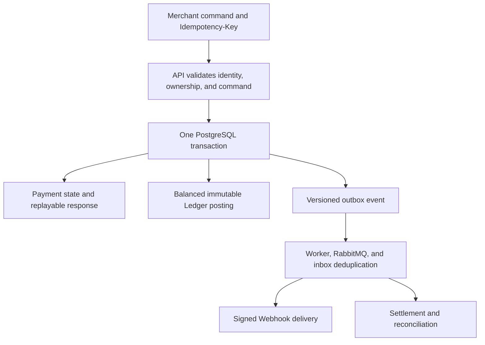

# SettleFlow

[](https://github.com/Sye-1321/SettleFlow/actions/workflows/ci.yml)
[](https://github.com/Sye-1321/SettleFlow/actions/workflows/security.yml)
[](https://github.com/Sye-1321/SettleFlow/actions/workflows/nightly.yml)
[](LICENSE)

Payment systems rarely fail cleanly. A database can commit after the client has already timed out. A worker can publish an event and crash before recording the confirmation. A message can be delivered twice. A Webhook receiver can stay offline for hours. Two settlement workers can race for the same Payment.

SettleFlow is an open-source, finance-grade simulation built to make the outcome of those failures explicit. It follows a merchant Payment from intent and capture through immutable double-entry accounting, reliable event delivery, signed Webhooks, settlement batching, and reconciliation against a mock provider statement.

The project demonstrates financial correctness through executable evidence, not a production-readiness claim. It does not connect to real payment rails, move funds, initiate payouts, or store cardholder data.

The authoritative baseline is the [SettleFlow v1.0 specification](docs/specification/SettleFlow_Technical_Product_and_Architecture_Specification_v1.0.docx), refined by accepted [architecture decisions](docs/adr/README.md) without weakening the [financial invariants](docs/architecture/financial-invariants.md).

## The problem it explores

Most payment examples demonstrate the successful request. SettleFlow concentrates on the moments after the happy path stops being reliable:

- A capture commits, but its HTTP response is lost. Can the merchant retry without creating another financial effect?
- Payment state is stored, then the process dies before an event reaches RabbitMQ. How does the event survive?
- RabbitMQ redelivers a message after a consumer crash. Can the consumer finish once without pretending the transport is exactly-once?
- A merchant endpoint rejects Webhooks or remains unavailable. Can delivery recover without changing the Payment?
- Concurrent refund or Settlement commands compete for the same money. Which command wins, and what prevents the others from corrupting the result?
- A provider statement disagrees with platform records. Can the difference be explained without rewriting financial history?

SettleFlow answers with explicit transactions, database constraints, idempotency records, an immutable Ledger, transactional outbox/inbox delivery, bounded retries, failure injection, and reconciliation that reports differences instead of repairing them silently.

## One financial command through the system



The Payment transition, Ledger posting, outbox event, and idempotency response snapshot commit together or roll back together. RabbitMQ publication and Webhook delivery happen after commit and may repeat. PostgreSQL remains the authoritative financial store throughout the flow.

The codebase is a NestJS modular monolith with separate API and worker deployables. This keeps money-changing invariants inside one database transaction while allowing asynchronous work to fail and recover independently. See the [architecture overview](docs/architecture/README.md), [system flows](docs/architecture/system-flows.md), and [module boundaries](docs/architecture/module-boundaries.md) for the complete design.

## Failure scenarios covered

| Failure                               | Guarantee preserved                                     | Primary mechanism                                                                   |
| ------------------------------------- | ------------------------------------------------------- | ----------------------------------------------------------------------------------- |
| Client retries after a lost response  | One financial side effect and a replayable result       | Merchant-scoped idempotency ownership, canonical fingerprints, and stored responses |
| Process dies after state commit       | The event intent remains durable                        | Outbox row committed in the same PostgreSQL transaction                             |
| Relay dies after broker confirmation  | A republished event does not repeat the consumer effect | Short outbox leases, stable event IDs, and inbox uniqueness                         |
| Consumer dies before acknowledgement  | Broker redelivery becomes a completed-inbox no-op       | Effect and inbox record commit before manual acknowledgement                        |
| Webhook receiver is unavailable       | Payment and Settlement history remain unchanged         | Persisted attempts, bounded jittered retries, and a terminal dead-letter state      |
| Concurrent refunds exceed the capture | Committed refunds never exceed captured value           | Payment row lock, cumulative checks, and transaction rollback                       |
| Settlement workers race               | A Payment belongs to at most one batch                  | `FOR UPDATE SKIP LOCKED` and unique batch membership                                |
| Reconciliation finds a mismatch       | Authoritative financial history is not rewritten        | Deterministic, non-mutating mismatch classification                                 |

## Implemented capabilities

| Area            | What the repository implements                                                                                     |
| --------------- | ------------------------------------------------------------------------------------------------------------------ |
| Merchant Access | Hashed, scoped, revocable API keys with one-time plaintext disclosure and merchant-scoped persistence              |
| Payments        | Payment Intent create/read, deterministic direct full capture, and partial/full refunds in ETB or USD              |
| Idempotency     | Merchant-scoped command ownership, canonical fingerprints, leases, conflicts, and stored response replay           |
| Ledger          | Closed merchant chart, immutable double-entry postings, deferred balance enforcement, and exact reversals          |
| Eventing        | Transactional outbox, publisher confirms, durable inbox deduplication, manual acknowledgements, and DLQs           |
| Webhooks        | Endpoint management, encrypted rotating secrets, SSRF controls, exact-byte signatures, and bounded retries         |
| Settlements     | Merchant/currency-isolated eligibility, deterministic fees, batching, adjustments, and guarded Ledger finalization |
| Reconciliation  | Bounded mock-provider CSV staging and deterministic, non-mutating mismatch classification                          |
| Operations      | Redacted structured logs, correlation context, internal probes, metrics, alerts, hardened images, and CI evidence  |

Detailed claim-to-test evidence is maintained in the [engineering evidence guide](docs/review/engineering-evidence.md).

## Financial correctness

SettleFlow treats the following guarantees as release-blocking:

- Money is represented as positive integer minor units with an explicit currency.
- Payment, refund, or Settlement state commits with its balanced Ledger posting and outbox event, or every effect rolls back.
- Every posted Ledger transaction contains at least two entries, uses one currency, and has equal debit and credit totals.
- Posted Ledger transactions and entries are immutable. Corrections use a uniquely linked reversal.
- Row locking, constraints, and idempotency prevent over-refund, duplicate Settlement membership, and repeated financial side effects.
- Payment and Settlement lifecycles remain separate.
- Asynchronous delivery is explicitly at-least-once; SettleFlow does not claim exactly-once transport.

PostgreSQL constraints and triggers enforce the accounting boundary; application validation does not replace them. The complete normative rules are [INV-01 through INV-10](docs/architecture/financial-invariants.md).

## Run the deterministic demo

The isolated demo uses synthetic data to exercise the API, worker, PostgreSQL, RabbitMQ, Ledger, Webhooks, Settlements, Reconciliation, telemetry, and dependency-recovery paths. Docker with Linux containers and the pinned Node.js/pnpm toolchain are required.

PowerShell:

```powershell
pnpm install --frozen-lockfile
$env:SETTLEFLOW_DEMO_MODE = 'true'
pnpm demo
```

POSIX shell:

```sh
pnpm install --frozen-lockfile
SETTLEFLOW_DEMO_MODE=true pnpm demo
```

The ten-step flow proves idempotent creation, a same-key capture storm, balanced capture/refund/Settlement postings, signed Webhook retry, deterministic reconciliation, RabbitMQ outage recovery, outbox catch-up, and consumer deduplication. Read the [demo contract and safety boundary](docs/demo/README.md) before running or resetting it.

## How to review the evidence

A focused review can follow this path:

1. Read the [architecture overview](docs/architecture/README.md) and [system reliability flows](docs/architecture/system-flows.md).
2. Inspect the [financial invariants](docs/architecture/financial-invariants.md) and [Ledger foundation](docs/architecture/ledger-foundation.md).
3. Review the committed [OpenAPI contract](docs/api/openapi.json) and [event/Webhook schemas](docs/events/README.md).
4. Follow each public claim to its enforcement and executable proof in the [engineering evidence guide](docs/review/engineering-evidence.md).
5. Check the P0/P1, waiver, limitation, and pending-release record in the [requirements evidence matrix](docs/review/requirements-evidence-matrix.md).
6. Run the [deterministic demo](docs/demo/README.md) when Docker is available.

CI verifies formatting, linting, type safety, module boundaries, contracts, migrations, grants, financial invariants, real-dependency integration, concurrency, failure recovery, security policy, image scans, SBOMs, and provenance evidence. Current results belong to the linked workflows and evidence guide rather than a stale test-count badge.

## Project status and boundaries

SettleFlow is a **pre-release finance-grade simulation**. It is not production-ready or specification-complete.

The project intentionally excludes real payment providers, bank transfers and payouts, card storage, KYC/AML, customer wallets, subscriptions, FX, tax, disputes, chargebacks, authorize-then-capture, and partial capture. Public Ledger reads, Webhook-delivery inspection/manual replay, destructive retention jobs, dashboards, and a production KMS adapter are also deferred or waived for the current baseline.

The isolated PostgreSQL restore meets the reference RTO target, but a sustained backup cadence has not proven the RPO. Five reference k6 scenarios have executable definitions, while final-candidate measurements, clean-room release verification, and immutable `v1.0.0` publication remain open. Catastrophic RabbitMQ-volume loss can still lose published-but-unconsumed work because controlled recovery replay is deferred.

These limitations are part of the engineering record. A successful demo or green CI run does not override them.

## Development

The repository pins Node.js and pnpm and uses one workspace lockfile. Install dependencies from the repository root:

```shell
corepack enable pnpm
pnpm install --frozen-lockfile
```

Local API and worker development requires the safe environment examples, PostgreSQL, RabbitMQ, runtime-role provisioning, and committed migrations. Follow the [local development guide](docs/operations/local-development.md) for the exact setup and reset commands.

Common source checks are:

```shell
pnpm format:check
pnpm lint
pnpm typecheck
pnpm test
pnpm build
pnpm docs:check
```

## Documentation

| Document                                                                      | Purpose                                                            |
| ----------------------------------------------------------------------------- | ------------------------------------------------------------------ |
| [Architecture overview](docs/architecture/README.md)                          | Deployables, consistency model, and bounded modules                |
| [System and reliability flows](docs/architecture/system-flows.md)             | Atomicity, outbox/inbox, Webhook, Settlement, and deployment flows |
| [Data model and ERD](docs/architecture/data-model.md)                         | Module-owned schema and critical relationships                     |
| [Architecture decisions](docs/adr/README.md)                                  | Accepted decisions, trade-offs, and specification refinements      |
| [OpenAPI](docs/api/openapi.json) and [HTTP examples](examples/http/README.md) | Machine-readable contract and synthetic request collection         |
| [Events and Webhook signing](docs/events/README.md)                           | Closed event schemas, AMQP metadata, and signed delivery           |
| [Continuous integration](docs/operations/continuous-integration.md)           | Quality, security, reliability, artifact, and supply-chain gates   |
| [Threat model](docs/security/threat-model.md)                                 | Assets, trust boundaries, controls, proof, and residual risk       |
| [Release documentation](docs/release/README.md)                               | Versioning, upgrades, draft notes, and blocking checklist          |
| [Runbooks](docs/runbooks/README.md)                                           | Failure diagnosis and evidence-preserving recovery                 |
| [Security policy](SECURITY.md)                                                | Vulnerability disclosure and security requirements                 |
| [Contributing](CONTRIBUTING.md)                                               | Governance, plans, reviews, migrations, and verification           |

## License

SettleFlow is licensed under the [Apache License 2.0](LICENSE). The license permits use, modification, and distribution under its terms; it does not make the simulation suitable for processing real funds or remove the independent review required for a regulated deployment.
