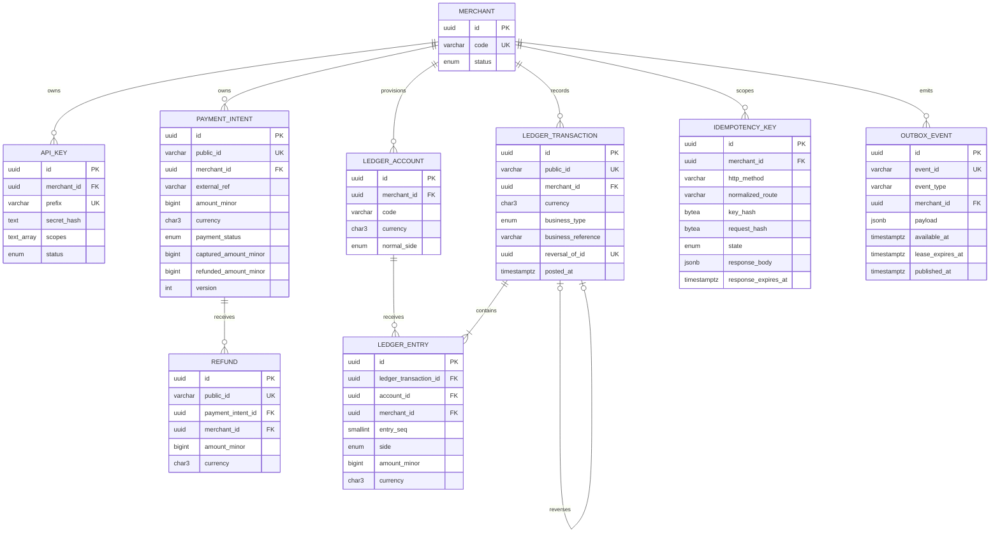
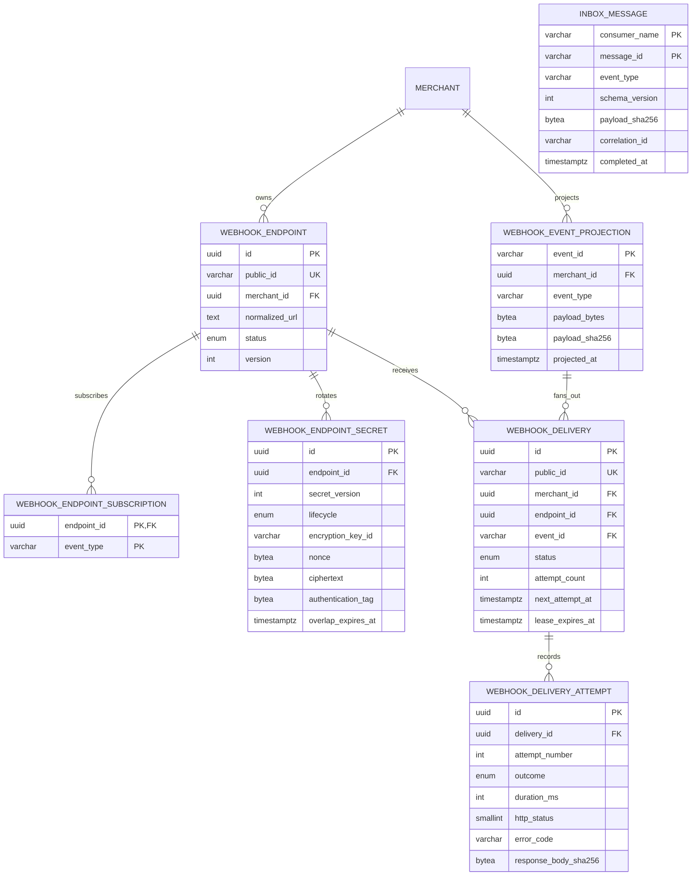
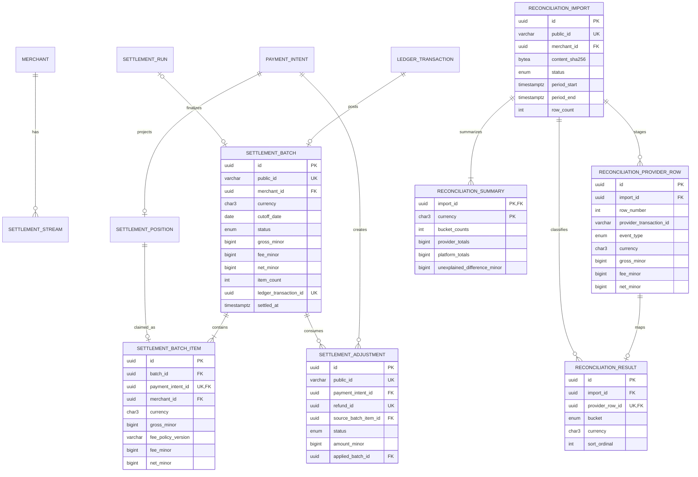

# Data Model and Schema Inventory

This is a readable inventory of the committed Prisma/PostgreSQL schema. It contains no database contents. [Prisma schema](../../prisma/schema.prisma) and committed [migrations](../../prisma/migrations) are executable evidence; the [specification](../specification/SettleFlow_Technical_Product_and_Architecture_Specification_v1.0.docx), [financial invariants](financial-invariants.md), and accepted ADRs remain authoritative.

PostgreSQL is the sole authoritative transactional and financial store. Internal primary keys are UUIDs unless a model uses a documented composite/business key; external identifiers use the accepted prefixed ULID forms. Money is stored as integer `BIGINT` minor units with an explicit ETB/USD currency.

## Ownership inventory

| Owner           | Tables                                                                                                                                                               | Purpose and critical boundary                                                                          |
| --------------- | -------------------------------------------------------------------------------------------------------------------------------------------------------------------- | ------------------------------------------------------------------------------------------------------ |
| Merchant Access | `merchants`, `api_keys`                                                                                                                                              | Tenant root; one-time API-key plaintext, slow hash at rest, closed scopes and lifecycle                |
| Payments        | `payment_intents`, `refunds`                                                                                                                                         | Merchant-owned Payment lifecycle and immutable refund results; no Settlement status column             |
| Ledger          | `ledger_accounts`, `ledger_transactions`, `ledger_entries`                                                                                                           | Closed chart and immutable posted double-entry accounting enforced at commit                           |
| Idempotency     | `idempotency_keys`                                                                                                                                                   | Single-winner command ownership, request fingerprint, lease, and response snapshot                     |
| Eventing        | `outbox_events`, `inbox_messages`                                                                                                                                    | Atomic event intent, publish leases, and durable consumer deduplication                                |
| Webhooks        | `webhook_endpoints`, `webhook_endpoint_subscriptions`, `webhook_endpoint_secrets`, `webhook_event_projections`, `webhook_deliveries`, `webhook_delivery_attempts`    | Endpoint policy, encrypted secrets, exact event bytes, leased delivery, and immutable attempt evidence |
| Settlements     | `settlement_streams`, `settlement_fee_policies`, `settlement_positions`, `settlement_runs`, `settlement_batches`, `settlement_batch_items`, `settlement_adjustments` | Event-driven eligibility, immutable fee/item snapshots, unique membership, and simulated clearing      |
| Reconciliation  | `reconciliation_imports`, `reconciliation_provider_rows`, `reconciliation_results`, `reconciliation_summaries`                                                       | Bounded untrusted staging and deterministic, non-mutating per-currency evidence                        |
| Operations      | `audit_events`                                                                                                                                                       | Append-only privileged lifecycle/action evidence                                                       |

Physical co-location does not grant cross-module writes. An owner exposes application ports or stable merchant-scoped readers; foreign keys reinforce integrity without changing ownership.

## Merchant, Payment, Ledger, and command records

Merchant/external reference uniqueness, cumulative Payment projections, prefixed public-ID checks, business-reference uniqueness, and composite owner/currency foreign keys are database constraints. Ledger entry positivity is immediate; entry count, debit/credit equality, currency agreement, and posting finalization are deferred constraint triggers checked at commit. Posted rows cannot be updated, deleted, or truncated; exact one-time reversal is the correction mechanism.

## Asynchronous and Webhook records

`inbox_messages` uses `(consumer_name, message_id)` as its primary key. A Webhook event projection retains exact validated bytes and their hash so delivery never reserializes the signed body. Endpoint/event uniqueness prevents duplicate initial fanout. Delivery attempts are append-only evidence; delivery state changes are guarded by claim ownership and the runtime role.

## Settlement and Reconciliation records

Settlement selection uses locked, deterministic candidates and unique `payment_intent_id` membership. Each batch is exactly one merchant/currency; immutable item rows snapshot the fee policy and arithmetic. Reconciliation imports own their rows, results, and exactly two ETB/USD summary records. Reports never mutate the platform evidence they compare.

## Derived and deliberately absent state

- Payment reads compose Settlement status from Settlement-owned records; `payment_intents` has no `settlement_status` column.
- Ledger balances are derived from immutable entries; there is no mutable balance table.
- RabbitMQ queue state and telemetry are not replicated as accounting records.
- Real provider, payout, bank, PAN/CVV, KYC, wallet, subscription, FX, tax, dispute, and chargeback tables do not exist.
- Manual Webhook replay, delivery-inspection, public Ledger-read, and destructive retention records/endpoints are waived or deferred as listed in the [v1 release notes](../release/v1.0.0.md).

## Migration and access boundary

The migration/owner role applies the complete ordered migration history and provisions least-privilege grants. API and worker use non-owner `settleflow_app`; schema ownership and migration credentials are never available to the normal processes. Prisma handles routine access. Reviewed parameterized raw SQL is limited to lock/claim, deferred-trigger, permission, and concurrency behavior Prisma cannot express safely.

Use `pnpm prisma:validate`, `pnpm db:migrate:verify`, `pnpm db:permissions:check`, `pnpm db:invariants:check`, and `pnpm db:schema:drift` for executable schema evidence. Do not infer authorization from a relationship diagram; tenant ownership must be present in the database predicate.
