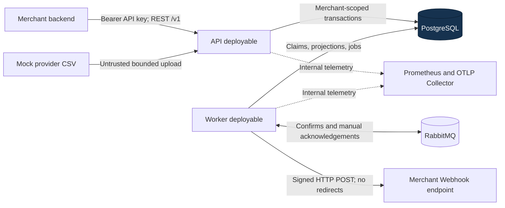
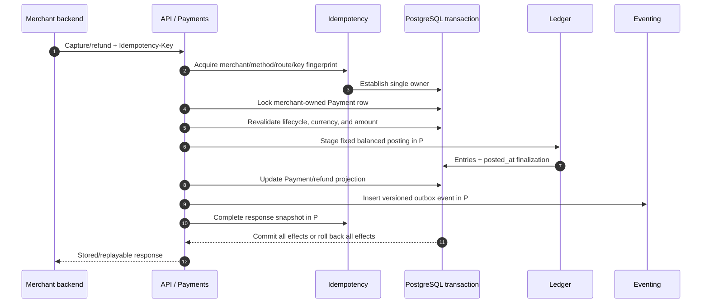
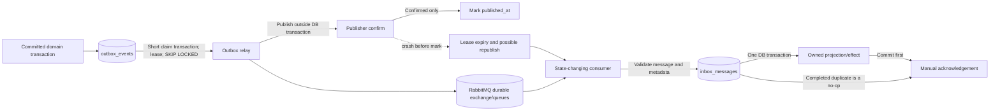
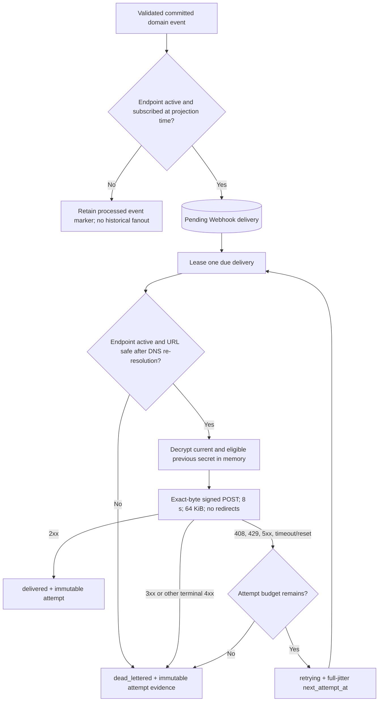
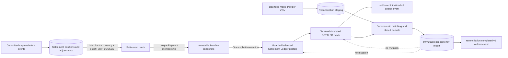
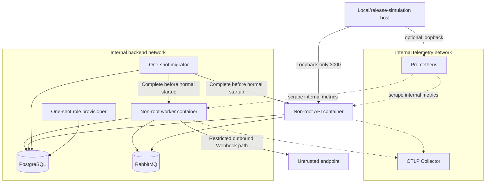

# System and Reliability Flows

These diagrams describe the implemented SettleFlow finance-grade simulation. The [v1.0 specification](../specification/SettleFlow_Technical_Product_and_Architecture_Specification_v1.0.docx), accepted [ADRs](../adr/README.md), [module boundaries](module-boundaries.md), and [financial invariants](financial-invariants.md) remain authoritative.

## System context

PostgreSQL is the only authoritative transactional and financial store. RabbitMQ, merchant endpoints, CSV input, logs, metrics, and traces are non-authoritative. No real payment rail, bank, payout system, or card-data system is connected.

## Payment and Ledger atomicity

RabbitMQ and Webhook availability are outside this transaction. INV-01 through INV-07 and INV-10 are enforced by row locks, uniqueness, checks, restricted grants, immutable-row triggers, and deferred commit-time Ledger triggers.

## Transactional outbox and inbox

The design intentionally provides at-least-once delivery. Stable event IDs plus `(consumer_name, message_id)` uniqueness prevent repeated state-changing effects; they do not create an exactly-once transport claim.

## Webhook projection and delivery

Automatic retries keep the delivery ID and exact body but use a new timestamp/signature. Manual replay and merchant delivery inspection are approved v1 waivers and do not exist.

## Settlement and reconciliation

A finalized Settlement means simulated internal clearing, not a bank payout. Reconciliation differences are investigation evidence and never authority to edit Payment, Ledger, or Settlement history.

## Deployment and network boundaries

API, worker, and migrator images are non-root, read-only compatible, capability-free runtime images. PostgreSQL, RabbitMQ, worker probes, application metrics, and OTLP are not public host ports. This is a production-shaped release simulation, not a production deployment topology.

## Failure model

| Failure                   | Preserved guarantee                                      | Observable recovery path                                                            |
| ------------------------- | -------------------------------------------------------- | ----------------------------------------------------------------------------------- |
| PostgreSQL unavailable    | No financial command commits                             | API/worker readiness fails; use the database-recovery runbook                       |
| RabbitMQ unavailable      | Committed financial state and outbox intent remain valid | Worker unready; relay retries and backlog alerts fire                               |
| Relay crash after confirm | Republish is allowed                                     | Inbox deduplication prevents another consumer effect                                |
| Consumer crash before ack | Committed effect remains durable                         | Broker redelivery becomes a completed-inbox no-op                                   |
| Merchant endpoint failure | Payment/Settlement state is unchanged                    | Bounded retries end delivered or dead-lettered                                      |
| Settlement race           | One Payment belongs to at most one batch                 | Locks plus unique membership; losing transaction rolls back                         |
| Reconciliation mismatch   | Authoritative records remain immutable                   | Investigate the report; reverse/forward-fix only through an approved financial path |

Use the [runbook index](../runbooks/README.md), [alert catalog](../operations/alert-catalog.md), and [engineering evidence map](../review/engineering-evidence.md) for executable diagnostics and proof.
