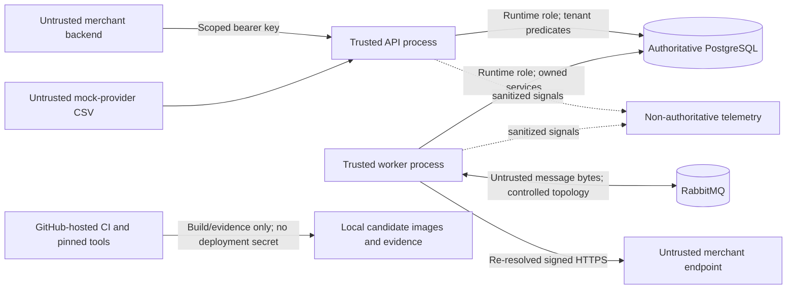

# SettleFlow Threat Model

## Scope and posture

This threat model covers the implemented SettleFlow finance-grade simulation: merchant API access, PostgreSQL financial state, RabbitMQ event delivery, outbound Webhooks, mock-provider CSV reconciliation, telemetry, local/release-simulation containers, CI, and release evidence. It does not certify production security or authorize real funds, payment credentials, personal data, or a regulated deployment.

The [security policy](../../SECURITY.md), [financial invariants](../architecture/financial-invariants.md), accepted [ADRs](../adr/README.md), and authoritative [v1.0 specification](../specification/SettleFlow_Technical_Product_and_Architecture_Specification_v1.0.docx) control this summary.

## Assets and security objectives

| Asset                                                            | Required property                                                           | Authoritative location                                     |
| ---------------------------------------------------------------- | --------------------------------------------------------------------------- | ---------------------------------------------------------- |
| Payment, Refund, Ledger, Settlement, and Reconciliation evidence | Integrity, tenant isolation, traceability, and controlled recovery          | PostgreSQL                                                 |
| API credentials                                                  | One-time disclosure, non-recoverable slow hash at rest, revocation/rotation | Merchant Access plus external secret handling              |
| Webhook signing material                                         | Confidentiality, authenticated encryption, versioned rotation               | Encrypted PostgreSQL record plus external keyring material |
| Idempotency and asynchronous evidence                            | Stable identity, deduplication, bounded ownership, replay-safe outcomes     | PostgreSQL outbox/inbox/idempotency records                |
| Audit and delivery-attempt records                               | Append-only privileged/action evidence                                      | PostgreSQL with restricted grants/triggers                 |
| Release artifacts and source                                     | Provenance, reproducibility, vulnerability/license evidence                 | Git commit, CI evidence, SBOMs, immutable image digests    |
| Logs, metrics, and traces                                        | Availability and safe correlation without secret/body disclosure            | Non-authoritative internal telemetry                       |

Primary objectives are to prevent cross-merchant access, duplicate financial effects, Ledger/audit tampering, credential disclosure, Webhook forgery/replay/SSRF, unbounded CSV/resource abuse, poison-message effects, and supply-chain substitution.

## Trust boundaries

The API/worker boundary is trusted only for the permissions explicitly granted to each process. A shared database does not permit a module to write another module's tables. RabbitMQ messages, Webhook destinations, CSV files, dependency metadata, and pull-request content are untrusted inputs.

## Threat, control, and proof register

| Threat                                                    | Primary controls                                                                                                                                                                   | Executable/public evidence                                                                         | Residual risk or response                                                                        |
| --------------------------------------------------------- | ---------------------------------------------------------------------------------------------------------------------------------------------------------------------------------- | -------------------------------------------------------------------------------------------------- | ------------------------------------------------------------------------------------------------ |
| Stolen or guessed API key                                 | 256-bit secret, public-prefix lookup, salted scrypt hash, scopes, generic 401, revocation/rotation, no credential logs                                                             | Merchant Access unit/integration and authentication-negative tests; secret scan                    | No public self-service lifecycle API; owner/internal provisioning remains a maintenance boundary |
| Cross-merchant access or insecure direct object reference | Merchant identity from credential; merchant ID in every owned database predicate; composite owner FKs; safe 404                                                                    | Tenant-negative API/PostgreSQL integration tests; boundary checks                                  | Any cross-tenant result is a critical release blocker                                            |
| Duplicate/replayed command                                | Merchant/method/route/key uniqueness, canonical fingerprint, lease owner, row locks, stored response, business uniqueness                                                          | Idempotency mismatch/in-progress/replay tests and capture/refund/Settlement races                  | Response retention is finite; destructive retention job is not implemented                       |
| Financial arithmetic or Ledger tampering                  | Integer minor units, closed currency/chart/types, deferred balance triggers, immutable posted rows, restricted role, reversal-only correction                                      | INV-01–INV-10 database, permission, rollback, and concurrency tests                                | No public Ledger read API; investigation uses controlled database evidence                       |
| Outbox dual-write loss or duplicate message effect        | Event intent in producer transaction, short claim lease, publisher confirm, stable event ID, inbox uniqueness, ack after commit                                                    | Broker outage, competing relay, publish-before-mark, consume-before-ack, dedupe, poison tests      | Catastrophic broker-volume loss can lose confirmed-but-unconsumed work; no replay tool exists    |
| Webhook forgery or replay                                 | HMAC-SHA-256 over exact bytes, delivery/event IDs, timestamp, constant-time receiver comparison, current/previous secret overlap                                                   | Signature vectors, exact-byte tests, rotation overlap, deterministic verifier                      | Delivery is at least once; receivers must atomically deduplicate by delivery ID                  |
| Webhook SSRF, DNS rebinding, redirect escape              | Canonical registration validation, HTTPS/443 production policy, global-address checks, bounded DNS, delivery-time re-resolution, one pinned address, no redirects, egress boundary | URL/IP corpus, rebind simulation, redirect, timeout, and response-limit tests                      | Local HTTP works only under explicit development allowlist; production KMS/topology is deferred  |
| Secret/keyring disclosure                                 | Environment indirection, encrypted secrets, redaction, no body/signature logging, ignored generated config, scans                                                                  | Redaction tests; repository/history scan; image filesystem scan                                    | Local keyring is forbidden in `NODE_ENV=production`; a production adapter is deferred            |
| CSV parser/resource abuse                                 | Exact multipart shape, 10 MiB/50,000-row/16 KiB-row/31-day limits, strict UTF-8/schema/arithmetic, checksum, failed staging                                                        | Malformed, oversized, row-limit, controls, duplicate, wrong-merchant/window, and exact-match tests | Input is buffered within the approved finite bound; no real provider import is supported         |
| Poisoned or incompatible event                            | Exact event/AMQP metadata schemas, 16 KiB body limit, immediate DLQ for invalid input, fingerprint conflict detection                                                              | Event contract, invalid metadata/body, DLQ, and redelivery tests                                   | No manual DLQ/replay API; operator preserves evidence and forward-fixes                          |
| Telemetry leakage or authority creep                      | Infrastructure-owned adapter, allowlisted/redacted fields, bounded labels, internal listeners, non-interference                                                                    | Redaction, cardinality, exporter failure, readiness, and shutdown tests                            | Prometheus/Collector profile has no authentication because it is internal/loopback only          |
| Compromised dependency, action, scanner, or base image    | Frozen lockfile, exact Node/pnpm, SHA-pinned actions, digest-pinned images/tools, dependency/license review, CodeQL, secret/container scans, SBOM/provenance                       | CI/security workflows and retained bounded evidence                                                | GitHub services/settings are external controls; final artifact promotion remains manual          |
| Malicious schema/migration or privileged row edit         | Separate owner and `settleflow_app`, one-shot migrations, reviewed SQL, full empty/prior fixture checks, immutable triggers/grants                                                 | Migration history, drift, permission, invariant, isolated restore verification                     | Initial v1 has no prior public release; future releases require maintained upgrade fixtures      |
| Destructive operator recovery                             | No public operator API, append-only audits, documented prohibited edits, isolated restore, forward-fix/reversal rules                                                              | Runbooks, recovery safety tests, restore exercise                                                  | Sole maintainer means no independent on-call or backup maintainer                                |

## Abuse cases and fail-closed behavior

- A valid key requesting another merchant's Payment, endpoint, Settlement, or report receives the same safe not-found result as an absent identifier.
- Reusing an idempotency key with a different canonical command returns `409`; it cannot create a second financial effect.
- A Ledger imbalance, mixed currency, late entry, mutation, or invalid reversal fails at or before transaction commit.
- An unsupported event or conflicting duplicate is rejected/DLQed; it is not coerced into a known schema.
- A Webhook URL resolving to loopback, private, link-local, multicast, reserved, or metadata space is rejected immediately before contact.
- A malformed/out-of-window/wrong-merchant CSV is marked failed with zero durable provider rows and cannot be claimed as a completed report.
- PostgreSQL failure makes financial commands unavailable. RabbitMQ or telemetry failure never converts an uncommitted/unknown command into success.

## Data minimization and evidence handling

Only synthetic data belongs in source, fixtures, screenshots, CI artifacts, logs, traces, and performance evidence. Prohibited values include authorization headers, raw API keys, idempotency-key values in telemetry, Webhook secrets/signatures, encryption keys, raw financial bodies, full Webhook payloads by default, CSV row contents, and internal network/SQL detail in public problems.

Public evidence records bounded counts, states, hashes, command/tool versions, image digests, elapsed times, and sanitized identifiers. Authoritative financial and audit evidence is preserved during an incident; non-authoritative telemetry containing a secret is isolated/deleted under incident control after the credential is rotated.

## Accepted release limitations

The release owner has accepted these classifications for the first finance-grade simulation:

- P0 waivers: no controlled/manual Webhook replay API or replay audit path, merchant Webhook-delivery inspection API, public Ledger transaction read API, or destructive Table 23 retention jobs.
- P1 deferrals: authorize-then-capture, dashboards/operator search, distributed trace continuity through outbox messages, and a production KMS/keyring adapter.
- Operational limits: no real providers/payouts, no 24x7 support/SLA, no production topology, no complete async recovery after catastrophic RabbitMQ-volume loss, and no prior-public-version upgrade proof for the initial release.

These do not waive INV-01 through INV-10, tenant isolation, secret handling, SSRF defense, financial atomicity, or vulnerability gates. The detailed owner/risk/follow-up register is in the [requirements evidence matrix](../review/requirements-evidence-matrix.md) and [draft release notes](../release/v1.0.0.md).

## Incident and review ownership

`@Sye-1321` is the sole Security Owner, Incident Commander, disclosure authority, and release stop/go authority. There is no backup maintainer or 24x7 commitment. Suspected vulnerabilities use [GitHub Private Vulnerability Reporting](../../SECURITY.md#reporting-a-vulnerability); financial/security blockers stop promotion.

Review this model whenever an external integration, public/operator endpoint, data class, module ownership rule, schema, secret provider, egress policy, deployment topology, recovery capability, or release process changes. Use the [incident-response](../runbooks/incident-response.md), [database-recovery](../runbooks/database-recovery.md), [Ledger invariant](../runbooks/ledger-invariant-failure.md), [Webhook](../runbooks/webhook-delivery.md), and [CI/security](../runbooks/ci-security-gate-failure.md) runbooks for containment.
